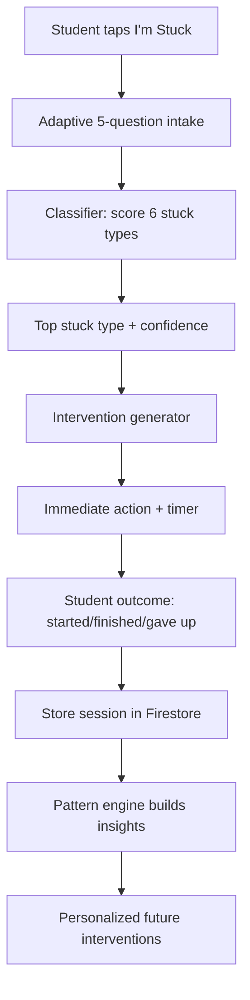

# Stuck: Model + Product Blueprint

## Statement of Goals
Stuck is a diagnostic and intervention engine for academic paralysis. Instead of telling students to "focus more," it identifies the most likely blocker behind inaction (confusion, ambiguity, fear, overwhelm, exhaustion, or perfection loop) and prescribes the smallest next action that restores momentum. The intended audience is middle school, high school, and college students who experience repeated homework freeze, plus educators/counselors who want clearer insight into why students stall.

## Functional Description (MVP)
Priority features:
1. **30-second adaptive diagnosis (5 questions):** The app asks short, non-judgmental questions and classifies one primary stuck type with confidence.
2. **Automatic intervention plan:** Immediately returns a type-specific micro-plan (5-20 minutes total) with one first action, timed steps, and reflection prompt.
3. **Pattern learning for personalization:** Stores session outcomes and generates trend insights (subject-specific patterns, time-based spikes, repeated fear/perfection loops).

## Technical and Data Feasibility
### Required data
- Real-time session input: assignment context, 5 diagnosis answers, optional behavioral signals.
- Outcome tracking: started/finished/gave up, intervention used, time stuck.
- Longitudinal analytics: repeated stuck types by subject/day/time.

### Data sources
- MVP does not require web scraping or therapist transcripts.
- Initial model is a transparent rule-based engine in TypeScript (`model/`), which is easier to validate for student safety and school compliance.
- Later versions can use supervised fine-tuning on anonymized, consented interaction logs and public educational guidance corpora.

### Existing technologies/APIs
- **Frontend/API:** Next.js App Router.
- **Model runtime:** TypeScript inference engine in `model/`.
- **Storage/auth:** Firebase Authentication + Firestore.
- **Optional GenAI support (future):** LLM for instruction rephrasing and clarification-question generation with strict anti-cheating guardrails.

## User Interface (Wireframes + Journey)
### 1) Home / Trigger
```text
+--------------------------------------+
| Stuck                                |
| "No shame. Let's find the blocker."  |
|                                      |
|            [ I'M STUCK ]             |
|                                      |
| Recent insight: Fear in math spikes  |
| before tests.                        |
+--------------------------------------+
```

### 2) Diagnosis (Adaptive, 5 questions)
```text
+--------------------------------------+
| Q2/5                                 |
| If you had to submit something bad   |
| in 5 minutes, could you?             |
|                                      |
| ( ) Yes   ( ) Maybe   ( ) No         |
|                                      |
| [Back]                      [Next]    |
+--------------------------------------+
```

### 3) Result + Intervention
```text
+--------------------------------------+
| Diagnosis: Fear Stuck (82%)          |
| You understand the material.         |
| Fear of grade impact is blocking     |
| action.                              |
|                                      |
| First step (1 min):                  |
| "My grade is data, not identity."    |
|                                      |
| [Start 5-min Ugly Draft Timer]       |
+--------------------------------------+
```

### 4) Insight Dashboard
```text
+--------------------------------------+
| Weekly Patterns                      |
| - Fear-stuck in math: 5 sessions     |
| - Overwhelm peaks Sunday nights      |
| - Avg stuck duration: 64 minutes     |
|                                      |
| [View suggestions]                   |
+--------------------------------------+
```

## Flow Chart / Structural Diagram


## Persistent Storage
The app uses **Firebase**:

### Auth
- Firebase Authentication for account identity.
- Credentials handled by Firebase Auth provider (not stored manually in Firestore).

### Firebase collections
1. `users/{userId}`
- `displayName`
- `phoneNumber` (optional)
- `createdAt`
- `consentFlags`

2. `users/{userId}/sessions/{sessionId}`
- `createdAt`
- `subject`
- `assignmentType`
- `stuckType`
- `emotion`
- `timeStuckMinutes`
- `interventionUsed`
- `outcome`

3. `users/{userId}/insights/{insightId}`
- `generatedAt`
- `key`
- `message`
- `confidence`

### Local vs cloud
- **Cloud (Firebase):** source of truth for cross-device history and personalization.
- **Local device storage:** optional short-term cache for offline session capture and retry sync.

### Privacy/safety notes
- Store minimal personally identifiable data.
- Separate educational support from clinical claims.
- Keep anti-cheating policy explicit in UI and API responses.
